  

### Selected work

**[signal](https://github.com/thisisreyy/signal)** · autonomous growth agent that checks Google rankings daily, with durable memory, idempotent runs and crash recovery. TypeScript, Bun, Convex, Cloudflare Workers. → [live](https://signal-worker.reydev.workers.dev)

**[pennywise](https://github.com/thisisreyy/pennywise)** · personal finance tracker that clusters spending with K-Means instead of fixed categories. FastAPI, React, Postgres. 234 backend tests, run against a real database. → [live](https://pennywiseexpensetracker.com)

**[growthlens](https://github.com/thisisreyy/growthlens)** · Instagram growth strategist: performance audits, health scores, content plans. Next.js, Prisma, Stripe, CI on every push.

**[interviewcoach](https://github.com/thisisreyy/interviewcoach)** · scores spoken interview answers against an ML rubric and returns coaching feedback. FastAPI, React, XGBoost.

---

Every README here ends with a **Known limitations** section. That is deliberate. Plausible output is not the same as correct output, and a system should show its work so a human can check it.

Manchester, UK · [aatreyeechatterjee.com](https://aatreyeechatterjee.com)
